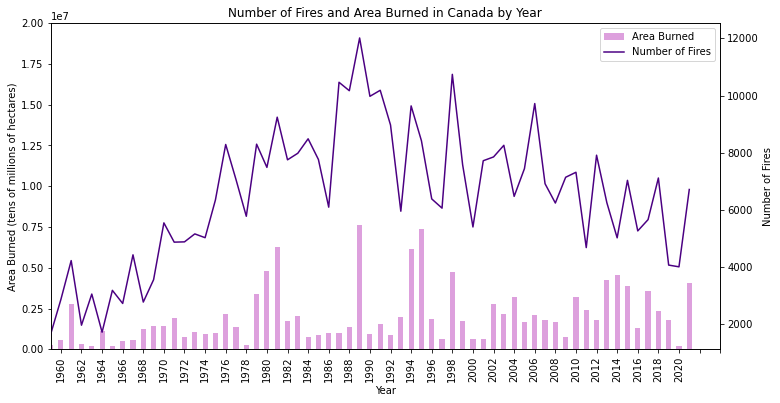

## _Lab 2 - Reading and Displaying Data_
***
##### Asia Beard 
This README.md file should be populated prior to final submission and should include your name (as the author), a description of the lab, some discussion of the results, and should **show** your final infographic.  For example, here is image from the NRCan data:

###

UNder here is my stuff

Asia Beard

A DESCRIPTION OF THE LAB GOES HERE

SOME DESCRIPTION OF THE CO2 DATA (90's drop in increase??)

IMAGE GOES HERE

TALK ABOUT THE FIRES GETTING BIGGER

IMAGE GOES HERE

talk about lack of correlation between datasets

INFOGRAPHIC AND WHAT THAT DISPLAYS

